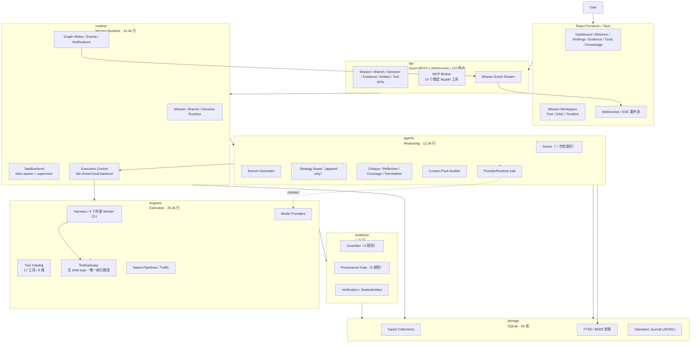

# Lynceus

<p align="center">
  <a href="LICENSE"></a>
  <a href="https://github.com/Cyr1s-dev/Lynceus/releases"></a>
  <a href="https://github.com/Cyr1s-dev/Lynceus/stargazers"></a>
  <a href="https://www.rust-lang.org/"></a>
  <a href="#execution-model"></a>
  <a href="https://github.com/Cyr1s-dev/Lynceus/issues"></a>
</p>

> *"He had the keenest eyes of all mortal men—able to discern what lay hidden within a hollow oak, and to see clear to the ends of the earth."*
> — Pindar, *Nemean Ode X*, on Lynceus

**Lynceus** 是一个以 **evidence-chain（证据链）** 为核心、由 Agent 驱动的自动化安全审计平台。

它把一次安全审计建模为一场 **Mission**：围绕明确目标、约束和成功条件，由 Manager 调度多个 Solver 并行探索，调用不同类型的安全工具，并要求每一条最终 finding 都能追溯到真实执行产生的证据。

> **Provenance Is Sacred.**
> 能"看见"一个漏洞不够，Lynceus 更关心它能不能被证明。

---

## Why Lynceus

大模型已经可以生成大量安全分析、攻击假设和工具调用建议，但安全审计真正困难的部分并不是"想出一个可能性"，而是：

- 这个假设是否值得继续探索？
- 当前环境是否满足前置条件？
- 应该调用哪个工具、以什么方式调用？
- 工具输出是否真的支持这个结论？
- 如果失败，是假设错误、工具不适用，还是证据不足？
- 多条探索路径如何并行而不互相污染状态？
- 如何避免 Agent 在长程任务中循环、发散或凭空补全事实？

Lynceus 的目标不是做一个"扫描器套壳"，而是构建一个 **execution-grounded security agent runtime**：

```text
Mission
  ↓
Manager
  ↓
Solver Agents（假设 / 分支）
  ↓
Execution Harness（外部 Agent CLI + 工具网关）
  ↓
Security Tools（无 shell argv）
  ↓
Evidence（SHA-256 封存工件）
  ↓
Guardian + Provenance Gate
  ↓
Finding / Needs Review / Gap
```

---

## Core Principles

| 原则 | 含义 |
|---|---|
| **Evidence-first** | Finding 必须能追溯到真实 `ToolInvocation` 输出，而不是模型文本。 |
| **Execution-grounded** | Agent 通过真实工具反馈不断更新假设，而不是只在语言模型内部推演。 |
| **Provenance Is Sacred** | 出处闸门属于系统硬约束，不能为了"让流程跑通"而被弱化。 |
| **Demote, not Discard** | 证据不足的线索降级为 suspicious / gap / phenomenon，而不是直接丢失。 |
| **Bounded Exploration** | 分支、预算、重试、升级和工具调用都必须有边界。 |
| **Capability-first** | Agent 优先表达"需要什么能力"，而不是把推理逻辑绑定到某个具体工具。 |
| **Reasoning / Execution Separation** | Agent 决定"为什么做、下一步做什么"；Harness 决定"如何安全执行"。 |
| **Retrieval for Planning** | 知识检索服务于分支规划和策略选择，而不是普通聊天式问答。 |

---

## Current Architecture

Rust 工作区，10 个 crate，约 **10 万行 / 176 个文件 / 671 个测试**。



### Crate 职责

| Crate | 职责 |
|---|---|
| `api` | Axum REST / WebSocket / SSE 控制面，MCP Broker 挂载 |
| `runtime` | Mission、Run、Branch、Decision、TaskBackend、执行控制、事件 |
| `agents` | Solver 契约、分支生成、Critique、Strategy Board、Context Pack、ProviderRuntime trait |
| `engines` | 工具网关、Tool Catalog、CLI Adapters、Worker 进程管理、MCP、Model Providers |
| `evidence` | Guardian、Provenance Gate、Verification、SealedArtifact |
| `storage` | SQLite typed collections、FTS5 检索索引、事件与运行状态、JSONL Journal |
| `models` | 全部 wire 类型（21 个 AuditDomain、状态机、契约） |
| `intelligence` | crtsh / wayback 暴露面情报源 |
| `tools` | `knowledge-import` CLI 等独立二进制 |
| `diff` | 双跑 parity 对比工具 |

---

## 一次 Mission 的完整调用链

```text
POST /missions/{id}/start                       api/lib.rs:6881
  └─ AuditManager::start_mission                runtime/mission_runtime.rs:100
       ├─ per-mission 起停互斥锁 + epoch 复用判定                :109
       ├─ ensure_mission_run_branches                           :182
       │    ├─ retrieve_branch_knowledge（limit 24）            :569
       │    ├─ branch_generator.generate                        :437
       │    ├─ critique_and_admit_branches（CRITIC 准入）        :471
       │    └─ 全部拒绝 → 确定性 fallback branch                 :474
       └─ submit_mission_runtime → TaskBackend::submit          :281
            └─ tokio::spawn + supervisor → watch 通道            task_backend.rs:75
  └─ run_mission_runtime_safely                 mission_runtime.rs:333
       └─ run_branch_runtime                    branch_runtime.rs:208
            ├─ pass 循环 ×max_branch_passes（默认 10，[1,50]）
            │    └─ run_branch_wave：buffer_unordered（≤8）       :407
            │         └─ run_single_branch                        :591
            │              ├─ capability_router.route             capability_router.rs:62
            │              ├─ dispatch_intent → solve_with_heartbeat  :824 / :1164
            │              │    └─ DomainSolver::solve            solvers.rs:75
            │              │         └─ run_domain → 外部 CLI     dispatch.rs:59
            │              │              └─ tool_execute         broker/mcp.rs:695
            │              │                   └─ ToolBroker      broker/mod.rs:306
            │              │                        └─ ToolGateway tool_gateway.rs:81
            │              │                             └─ SealedArtifact + ToolInvocation
            │              └─ commit_solver_success                branch_runtime.rs:1551
            │                   ├─ enrich_solver_result_provenance（读盘算 SHA-256） :2343
            │                   ├─ validate_solver_references（悬空引用=硬错误）     :2381
            │                   ├─ commit_solver_result（单事务原子提交）  sqlite.rs:892
            │                   └─ Observer.review → FindingVerificationService
            │                        = Guardian + ProvenanceGate + 产品闸门
            │                        └─ 拒绝 → NeedsReview（降级不丢弃） :1979
            └─ closure 轮 ×max_closure_rounds（默认 2，[1,5]）
                 COV → META → MGATE → EGUARD                        closure.rs:74
```

**四个硬闸门的位置**：CRITIC（假设准入）→ CommandPolicy（spawn 前）→ Guardian（防乱写）→ ProvenanceGate（防洗稿，`confirmed` 唯一入口）。

**迭代模型**：Rust 侧没有逐步 ReAct 循环。`BaseSolver::solve` 是一次性契约（`agents/solver.rs:309`），多步迭代发生在两层——编排层的 pass/closure-round 循环，以及外部 Agent CLI 内部的工具循环（经 MCP Broker 到达 `ToolGateway`）。Solver 永不直接触达 `Repository`，只提交 proposed Facts/Evidence/Findings，Manager 是唯一写入口。

---

## Evidence Chain

所有安全工具执行结果进入独立证据层：

```text
ToolInvocation（argv + exit_code + duration + stdout 工件）
       ↓
Guardian（确定性格式与质量检查）
       ↓
Provenance Gate（Finding 是否真正绑定真实执行）
       ↓
Verification（复验 / 分类）
       ↓
Finding / Needs Review / False Positive / Gap
```

这条链路独立于 LLM Provider，Agent 不能直接绕过。

### Provenance Gate

`Finding` 升级到 `confirmed` 的唯一显式闸门（`evidence/provenance_gate.rs:57`）。四条规则短路求值：

| # | 规则 |
|---|---|
| A | `finding.evidence_ids` 非空 |
| B | 每个 evidence id 必须解析到真实 `Evidence` 记录 |
| C | 每条 Evidence 必须携带 `evidence_path`、`fingerprint`、`produced_by_tool_invocation_id` |
| D | 该 invocation id 必须存在于已知 `ToolInvocation` 集合 |

纯函数：无 I/O、无时钟、无模型调用，`#[must_use]`；拒绝原因字符串与 CPython `repr(list)` 逐字节对齐，用于双跑 diff。全工作区只有 2 个调用点（`broker/mcp.rs:1423` 与 `branch_runtime.rs:1972`），均在服务端——worker 只能拿到拒绝原因 JSON。模型层还有兜底：`Finding` 在反序列化路径上拒绝 `Confirmed` + 空证据链（`models/finding.rs:133`），"无证据的确认"在类型层不可表示。

### Guardian

防"乱写"的第一道门（`evidence/guardian.rs`），与 Provenance Gate（防"洗稿"）互补。四条确定性检查：证据链存在性、`Confirmed` finding 不得含 14 条投机措辞（may be / could be / likely / assume…）、linked evidence 必须带 path 与 fingerprint、title 非空。失败统一降级 `NeedsReview`——永不 panic、永不返回 Err。

### Verification

`FindingVerificationService::check_confirmation`（`evidence/verification.rs:84`）合并三道门：Guardian + ProvenanceGate + 产品闸门（当前仅 `web_exploit.flag_capture`）。

产品闸门是全仓唯一的密码学复验路径（`verification.rs:233`）：读盘 → 重算 SHA-256 与记录指纹比对 → 候选 flag 必须作为**连续字节窗口**出现在工件中。成功则签发 `product-verification.v1` 回执，供终止判定消费。这条设计有真实诱因：Python 参考实现 Windows 文本模式写文件会把 `\n` 转成 `\r\n`，内存与盘上哈希分叉，findings 卡死在 needs_review——`SealedArtifact` 因此把字节与指纹在构造时绑定，并字节精确落盘。

### Demote, not Discard

- `FindingStatus::Gap` / `Phenomenon` 是一等状态，"观察到但未确认"不丢；
- Observer 拒绝确认时降级 `NeedsReview`，而非保持 `Confirmed`；
- 分支生成失败/全拒 → 确定性 fallback branch，metadata 诚实记录 `fallback_reason`，僵尸 Mission 不存在；
- 重复 finding 保留并互相链接（`dedup_of`），不静默丢弃；
- 失败任务仍落一条 WorkerSummary 结算记录——用户看到的可以是"未完成"，不可以是空白。

---

## Execution Model

Lynceus **不自带执行层**：任务实际执行经外部 Worker Runtime 边界派发给用户本机安装的 Agent CLI（Claude Code / Codex / Pi / DeepSeek Harness）。

平台侧的安全工具由 **Tool Catalog**（`resources/tool-catalog/curated_tools.yaml` 为唯一元数据源，编译期内嵌）描述，经 **ToolGateway** 以无 shell 的 argv 子进程执行并全程审计；`lynceus-mcp` 的 `tool_execute` 必须委托该网关——**不存在第二执行路径**。

```text
CapabilityIntent（branch_kind + fact 类型集合 + 可用 solver）
       ↓
Solver → Worker Runtime（Claude Code · Codex · Pi · DSH）
       ↓
MCP Broker（14 个 façade 工具，安全工具绝不注册为 MCP 工具）
       ↓
ToolGateway（无 shell argv + 全程审计）
       ↓
ToolInvocation → 证据层
```

### 唯一执行路径

`ToolGateway` 是零尺寸 unit struct，只被 `ToolBroker` 持有（`tool_gateway.rs:71`）。`ToolRequest` 将 `program` 与 `args` 显式分离，执行即 `Command::new(&program)` + `command.args(&args)`——全链路没有 shell 字符串、没有 `sh -c`、没有命令拼接。可执行文件路径只来自受信 catalog 检测结果，绝不来自 worker 输入。

`tool_execute` 的守卫链按序短路（`broker/mod.rs:313`）：

1. **Tool Policy allowlist**——session 级，fail-closed；
2. **catalog 成员 + 本地可用**——必须声明 invocation 且检测为 installed；
3. **保留键守卫**——11 个键（program/argv/command/shell/cwd/env…）不允许 worker 设置；
4. **schema 校验**——catalog `invocation.params` 是唯一 schema 来源；
5. **预算 + 重复指纹**——16 次/会话、2 次/工具、900s，重复调用指纹去重；
6. **委托 ToolGateway**。

spawn 前还有 27 条禁则前缀（`rm -rf /`、`mkfs`、`iptables -F`…）在 `ToolGateway` 内拦截：命中即落一条 Error 审计记录，不起进程、不伪造成功。另有 5 条无法用前缀判定的禁则（SQL DROP、批量清空接口）作为**代码所有的指令尾**追加到 worker prompt——preset 改不掉它。

### Worker 治理

- **环境隔离**：子进程 `env_clear()` 后只注入 12 键平台白名单；厂商凭证、`HOME`/`USERPROFILE`/`XDG_CONFIG_HOME` 全部剔除（有回归测试逐项枚举）；CLI 只经 Lynceus Connection 鉴权，各自映射到私有 env 命名空间，隔离 home 强制指定。
- **进程管理**：stdin 传多行 prompt 并立即关闭管道（不经 argv——Windows `.cmd` shim 会按换行截断）；stdout/stderr 各 8 MiB 硬上限；超时与取消都收敛到显式进程树 kill（Windows 上 npm `.cmd` 的真实 worker 是孙进程 node，用声明序有序的 `KillTreeOnDrop` + `taskkill /F /T` 解决孤儿问题）。
- **短时授权**：每个 worker-run 签发独立 MCP grant——bearer 只存 SHA-256 digest、TTL 15 分钟、可吊销；scope 从服务端 grant 拷贝，**不信** worker JSON-RPC 输入；session allowlist 与 Agent preset 的 tools 求交集；`skill_load` 只能单调扩张（SKILL.md frontmatter `modules:` 声明之外的永不解锁）。
- **健康检查**：真实 `<binary> --version` spawn 探测，30s 缓存；无可用 runtime 时报出每个 runtime 的状态，绝不静默回退到内部执行。

### Capability-first

默认情况下 Agent 表达"需要什么能力"（由 `branch_kind` 字符串 + fact 类型集合 + 已注册 solver 推导），由 `CapabilityRouter`（`agents/capability_router.rs:62`，~390 行确定性决策表）路由到具体 solver 与配置；确有必要时 Agent 仍可显式指定工具与参数。分支标题禁止出现工具名——工具名分支是硬错误（`branch_generator.rs:616`）。

---

## Bounded Exploration

### 预算格

所有层级都有界，且 run 级步骤在 SQL 事务内抢占（`sqlite.rs:825`），不是内存计数器：

| 层级 | 默认 | 约束 |
|---|---|---|
| `max_total_steps`（run） | 64 | ≥1 |
| `budget_steps`（branch） | 4 | — |
| `max_steps`（intent） | 8 | — |
| `max_branch_passes` | 10 | [1,50] |
| `max_closure_rounds` | 2 | [1,5] |
| `max_initial_branches` | 不截断 | — |
| `intent_worker_concurrency` | 4 | [1,8] |
| `max_concurrent_workers` | 4 | [1,32] |
| 分支波并发 | 8 | clamp 到分支数 |
| Broker 预算 | 16 次 / 2 次每工具 / 900s | 每 worker 会话 |

### 探索调度

- **Attractiveness 排序**：priority 为基，已有 related findings +8、有 evidence +3、预算将尽（≥80%）−10，稳定降序——优先采"有矿"的分支。
- **Spiral ledger**：每波比较前后 finding 数，空转计数驱动下一波 swarm 扇宽（`empty_passes/3`，上限 +3）——只在当前攻击面采尽时扩张。
- **Closure 链**：COV（确定性覆盖度）→ META（LLM 分歧评估，失败即确定性降级并记录原因）→ MGATE（唯一能批准完成的出口门）→ EGUARD（升级预算门）。MGATE 判 Done 时 EGUARD 零方向准入——"裁决记录保持诚实，不留永远不会兑现的方向清单"。

### 崩溃安全

- **Generation token**（`Arc<()>`，`ptr_eq` 比对）：pause 时作废令牌，迟到的旧 runtime 无法写回。
- **Orphan 恢复**：`recover_orphaned()` 把所有非终态 execution job 标记 `Orphaned` 并回填 ToolInvocation。
- **Worker lease**：`(lease_id, worker_run_id, revision)` CAS 续约，revision 过期即"租约丢失"——而这不视为错误（任务结果已提交），只显式记录一条 FailureBoundary 观测。
- **永不被伪造的成功**：`solver_result_is_failure`——零产出且无成功调用才算失败。真实诱因：没有 bash 的 `pi` 退出 0 但什么都没做，曾被记为 succeeded 甚至靠"不报错"赢得竞争。

---

## Anti-Hallucination

| 机制 | 位置 | 做法 |
|---|---|---|
| 确定性 Critic | `agents/critique.rs` | 无模型。8 条断言式措辞 → Rejected；11 类推测词 + hit_signal → 可证伪；悬空 fact 引用 → Rejected；报告 append-only，永不改写假设 |
| 方向过滤 | `agents/metacognition.rs` | LLM 方向同样过 6 条 assertive 正则（is vulnerable / proves / confirmed / definitely…），**丢弃而不修复**；假设短于 20 字符拒绝 |
| 死循环检测 | `agents/escalation.rs` | 假设按 `" ".join(text.lower().split())` 归一化去重——已探索过的不能再次进池 |
| 结构化输出 | serde | `deny_unknown_fields`，无 schemars、无自动重试；解析失败一律确定性降级并留审计 note。韧性在 provider 路由层的熔断器（失败计数 → cooldown，成功复位） |
| Context 有界 | `agents/context.rs` | 2048 token 默认，mandatory-first 准入，每条文本并行一份 id 列表保标识符，token 估算按字符数/4（CJK 正确），**原始工件字节永不入 pack**（只进引用） |
| 标识符保真 | 全局 | 代码符号、CVE、CWE、CLI flags、路径、URL 在 context / retrieval / invocation / evidence / report 全链路保持原样 |
| 失败边界传承 | `agents/trajectory.rs` | 失败边界/阻塞/矛盾/工具失败**逐字**带入下一段摘要，恢复的 worker 不为已知死胡同重复付费 |

---

## Knowledge Retrieval

知识系统用于 **retrieval-augmented security planning**，不是聊天知识库。

当前实现是**纯词法检索**：

```text
Query
  ↓
Normalization / 别名展开（14 组 84 词条双语表，编译期内嵌）
  ↓
结构化过滤（kind / tool / technique / platform / protocol / tags）
  ↓
SQLite FTS5 / BM25（十列加权：title/aliases/tool 3.0 … body 1.0）
  ↓
Context Packing（有界）
```

- **中英混合召回**：unicode61 tokenizer 下中文召回靠应用层 `search_terms` 列——ingest 与 query 双侧对 CJK 串生成整块 + 重叠二元组（`利用文件上传实现RCE` → 整块 + `利用/用文/文件/…` + `rce`）。精确标识符（CVE、特权名）完整保留，不进别名表。
- **索引卫生**：写入与 FTS upsert 在同一事务，杜绝静默过期；`corpus_status` 三态（Empty/Stale/Ready）在索引行数、同步计数、`updated_at` 任一不一致时判 Stale；FTS 报错落 `fallback_linear_scan`，"无命中"与"检索不可用"可区分。
- **Provenance**：每个知识单元保留 `source` / `source_locator` / `content_hash` / `retrieval_method` / `retrieval_score`；每次检索落一条 `RetrievalInvocation` 遥测（query_hash、reason 分类、逐 hit 的 rank/score/matched_terms/`selected_for_context`），分支 metadata 反向引用该 invocation id——**每个分支记录它的知识是哪次检索产生的**。

向量检索 / RRF / Reranker 是后续可选增强，不是 Mission 启动依赖。GraphRAG 产品入口已退役，旧接口只返回 HTTP 410。

---

## Storage & Events

SQLite（bundled，WAL，单连接 Mutex 串行化，busy_timeout 5s）。59 张表：46 张 parity 表 + Intelligence Hub 5 张 + Worker/Skill 6 张 + 知识 FTS 2 个虚拟对象；20 个索引。实体住在 `payload` JSON 列，只有 4-5 个物理列。无迁移框架——幂等 `CREATE TABLE IF NOT EXISTS` + 两个定点 in-place 迁移。

三个事件通道，职责分明：

| 通道 | 语义 |
|---|---|
| `audit_events`（SQLite） | 结构化"刚发生了什么"，SSE/WS 回放的数据源 |
| `swarm-operations.jsonl`（每 mission 一个） | 全保真 trajectory，写前 redact、`sync_data()` fsync、**无 update/delete API**。策略字符串钉死：`raw_structured_redacted_records_no_summary_substitution` |
| `NotificationHub`（进程内） | 按 project fan-out，容量 512，**drop-oldest 保最新**，同步发布——卡死的 WebSocket 永远不会阻塞审计写路径 |

WS 传输先订阅后回放（回放期间不丢事件）、`gap` 帧报告丢弃数、3s 心跳刷新归属判定，无法归属本 Mission 的通知丢弃而非串给别的观察者。SSE 1s 轮询 50 条/次，读库失败发 heartbeat 而非断流。

---

## What Lynceus Is Not

- 一个把 LLM 接到 Nuclei 上的聊天界面
- 一个靠模型输出直接生成 findings 的扫描器
- 一个必须依赖向量检索才能运行的知识库
- 一个为了"Agent 化"而把每条判断逻辑拆成微服务的系统
- 一个默认信任外部工具元数据的执行器
- 一个允许模型绕过出处闸门的自治攻击脚本
- 一个带逐步 ReAct 循环的运行时——迭代在编排层与外部 CLI，solver 是一次性契约

Lynceus 更希望成为一个：

> **bounded, evidence-grounded, capability-driven security agent runtime**

---

## Design Decisions

改代码前值得先知道的三条边界。

总原则：**概念可以多，运行时边界必须少。** 只有独立持有生命周期、状态或 IO 的组件才值得成为 runtime boundary；单纯的规则、判定、策略或算法步骤，应尽量保持为 module / policy。

### 1. Reasoning is not execution

这是 Lynceus 最重要的代码边界：

```text
Agent:
  Why?
  What next?

Harness:
  How to execute it safely?
```

一个模块只要开始承担 LLM reasoning、动态 branch 或策略选择，就不再属于纯执行 Harness。反之，只要它是确定性工具组合，就应该优先作为 Native / Composite Tool。

### 2. Knowledge is not evidence

知识库可以告诉 Agent 某种漏洞通常如何验证、某个工具通常怎么调用、某项技术有哪些前置条件、某种误报模式如何识别。但 `KnowledgeCard` / `RetrievedKnowledge` 本身不能直接成为 confirmed finding 的证据。最终事实仍必须回到：

```text
Finding
  ↓
Evidence
  ↓
ToolInvocation
```

### 3. Preserve identifiers

代码符号、CVE、CWE、CLI flags、路径、URL、函数名、错误码和协议标识符必须尽可能保持原样，同时适用于 Agent context、Retrieval、Tool invocation、Evidence 和 Report rendering。

---

## Quick Start

### Backend

```bash
cargo build -p api
cargo run -p api
```

### Frontend

```bash
cd frontend
npm install
npm run dev
```

### Configuration

- LLM Provider（OpenAI-compatible / Claude / Gemini / Qwen / GLM / Local）
- Model Route（按 purpose 绑定，带熔断）
- Local Tool Path / Tool availability
- 可选 Intelligence 镜像：`LYNCEUS_CRTSH_BASE_URL`、`LYNCEUS_WAYBACK_BASE_URL`
- Skill root：`LYNCEUS_SKILLS_DIR`
- Workspace：`LYNCEUS_WORKSPACE_DIR`、`LYNCEUS_MISSION_WORKSPACE_DIR`

知识检索不要求向量库才能启动 Mission。

---

## Agent Skills

Skills are procedure manuals (`SKILL.md`) that a worker loads on demand through the MCP tools `skill_list` / `skill_load`. They are **not** evidence — a skill tells a worker *how* to approach a problem; only a finding that survives the evidence gates counts.

```text
resources/skills/   ← ships with the repo; the authoritative source
        │  seeded on api startup (only when missing)
        ▼
data/skills/        ← runtime root (gitignored); what SkillManager actually reads
```

`data/` is gitignored, so a fresh clone starts with an empty runtime root. On startup the api seeds `resources/skills/*` into `data/skills/`, which is why skills work out of the box.

Seeding is **additive only**: if `data/skills/<name>` already exists it is skipped entirely. Skills you create or edit through the UI/API are authoritative and are never overwritten by repo content, which also makes repeated startup idempotent.

| Skill | Origin |
| --- | --- |
| `ctf-*`, `solve-challenge` | Vendored from [ljagiello/ctf-skills](https://github.com/ljagiello/ctf-skills) (MIT) |
| `api-recon` | First-party for this project |

Provenance and per-skill license details live in [`resources/skills/NOTICE.md`](resources/skills/NOTICE.md).

Frontmatter 只解析一小组扁平 `key: value`：

```yaml
---
name: api-recon
description: 枚举网站 API 接口时使用此 skill。
modules: nuclei, httpx
---
```

`modules:` is the fail-closed unlock list: `skill_load` merges exactly those catalog tool ids into the worker's allowlist and nothing else. A skill with no `modules:` is a pure manual and unlocks nothing.

> Skills written for other agents (for example Claude Code's `allowed-tools:`) are **not** understood here — unknown frontmatter keys are silently ignored, which can leave a skill that reads fine but grants nothing.

---

## Status

仍处于快速迭代阶段，当前交付链为 Rust/Axum + React/Tauri。

当前重点不是堆叠更多 Agent、数据库或工作流中间件，而是继续稳定三个核心抽象：

```text
Mission Runtime
Knowledge Retrieval
Execution Harness
```

以及始终不变的一条证据链：

```text
Finding
  → Evidence
  → ToolInvocation
```

如果这条链无法成立，那么 Lynceus 宁愿回答：

> **证据不足。**

也不会制造一个看起来完整的事实。

---

## 许可与免责声明

### 开源协议

本项目采用 **GNU Affero General Public License v3.0（AGPL-3.0）** 授权，完整条款见仓库根目录的 [LICENSE](LICENSE) 文件。

这意味着任何人都可以自由使用、修改和分发本项目，但**衍生作品必须同样以 AGPL-3.0 开源**；特别地，**若你修改本项目并通过网络（如部署为在线服务）向用户提供，也必须向这些用户公开对应的完整源码**。

> ⚠️ **重要提示**：开源协议本身不限制软件的使用用途。以下的「使用限制」与「免责声明」是作者对使用者的额外约定与郑重声明，请务必遵守。

**本项目仅供个人学习、代码研究与本地技术验证使用，不得用于对任何线上系统或网站发起实际测试。**

### 允许使用范围

- 仅可用于**阅读、学习与研究本项目源码**，以及在**本地隔离环境**中进行技术原理验证；
- 适用于个人学习、学术研究、代码审阅等非攻击性用途。

### 禁止事项

- **严禁使用本工具对任何网站、线上服务或联网系统发起扫描、探测、利用或攻击**（无论是否获得授权、是否为自有资产）；
- 严禁将本工具用于任何实际的渗透测试、攻防对抗或生产环境；
- 严禁将本工具用于非法入侵、数据窃取、勒索、拒绝服务或任何破坏性、犯罪性活动；
- 严禁利用本工具从事违反所在国家/地区法律法规的行为。

### 合规责任

使用者须自行遵守所在国家/地区关于网络安全、数据保护与计算机犯罪的全部法律法规（在中国大陆包括但不限于《网络安全法》《数据安全法》《个人信息保护法》及相关司法解释）。**因使用本工具产生的一切法律责任与后果，均由使用者自行承担。**

### 免责声明

本项目按"现状（AS IS）"提供，不附带任何明示或默示的担保。作者及贡献者不对因使用本工具（无论使用方式得当与否）所导致的任何直接或间接损失、数据丢失、系统损坏或法律纠纷承担责任。**下载、安装或使用本项目，即表示您已阅读、理解并同意上述全部条款。**
